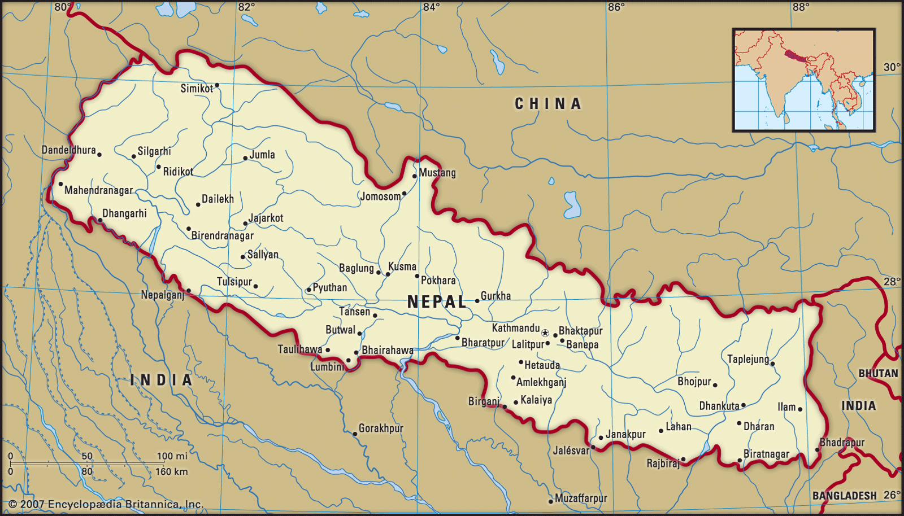

**Nepal**, long under the rule of hereditary prime ministers favouring a policy of isolation, remained closed to the outside world until a palace revolt in 1950 restored the crown’s authority in 1951; the country gained admission to the **United Nations** in 1955. In 1991 the kingdom established a multiparty parliamentary system. In 2008, however, after a decadelong period of violence and turbulent negotiation with a strong Maoist insurgency, the monarchy was dissolved, and Nepal was declared a democratic republic.

_Map of Nepal_
