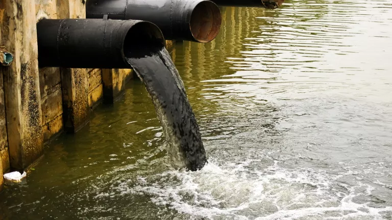

Our [rivers](#), reservoirs, [lakes](https://google.com), and seas are drowning in chemicals, waste, plastic, and other pollutants. Here’s why―and what you can do to help.

<!--  -->

<!-- _Pollution in Water Canal_ -->

# What Is Water Pollution?

Water pollution occurs when harmful substances—often chemicals or microorganisms—contaminate a stream, river, lake, ocean, aquifer, or other body of water, degrading water quality and rendering it toxic to humans or the environment.

This widespread problem of water pollution is jeopardizing our health. Unsafe water kills more people each year than war and all other forms of violence combined. Meanwhile, our drinkable water sources are finite: Less than 1 percent of the earth’s freshwater is actually accessible to us. Without action, the challenges will only increase by 2050, when global demand for freshwater is expected to be one-third greater than it is now

# What Are the Causes of Water Pollution?

Water is uniquely vulnerable to pollution. Known as a “universal solvent,” water is able to dissolve more substances than any other liquid on earth. It’s the reason we have Kool-Aid and brilliant blue waterfalls. It’s also why water is so easily polluted. Toxic substances from farms, towns, and factories readily dissolve into and mix with it, causing water pollution.

Here are some of the major sources of water pollution worldwide:

## Agricultural

_Agriculture pollution_

Not only is the agricultural sector the biggest consumer of global freshwater resources, with farming and livestock production using about 70 percent of the earth’s surface water supplies, but it’s also a serious water polluter. Around the world, agriculture is the leading cause of water degradation. In the United States, agricultural pollution is the top source of contamination in rivers and streams, the second-biggest source in wetlands, and the third main source in lakes. It’s also a major contributor of contamination to estuaries and groundwater. Every time it rains, fertilizers, pesticides, and animal waste from farms and livestock operations wash nutrients and pathogens—such bacteria and viruses—into our waterways. Nutrient pollution, caused by excess nitrogen and phosphorus in water or air, is the number-one threat to water quality worldwide and can cause algal blooms, a toxic soup of blue-green algae that can be harmful to people and wildlife.

## List of rivers with length

| Name of river | length |
| ------------- | ------ |
| Karnali       | 120 km |
| Bagmati       | 20 km  |
| Rapti         | 30 km  |

Please search in [google](https://google.com)
